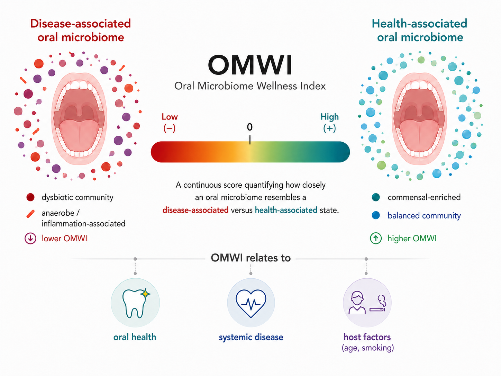

# OMWI: Oral Microbiome Wellness Index

<p align="center">
  
</p>

<p align="center">
  
  
  
  
  
</p>

OMWI is a biologically interpretable, metagenome-based score that quantifies how closely an oral microbial profile resembles a health-associated rather than a non-healthy-associated community state.

The model was developed from 1,866 publicly available human oral shotgun metagenomes spanning 27 studies, 13 countries, and 15 non-healthy phenotypes. The released species-level elastic-net model uses 50 non-zero taxonomic features.

> OMWI is a research tool, not a clinical diagnostic test. It does not identify a specific disease and should not be interpreted as an absolute measure of clinical wellness.

## Workflow

For paired-end oral shotgun metagenomes, the full pipeline performs four stages:

1. Quality control with fastp.
2. Human read removal against a GRCh38 Bowtie2 index.
3. Species-level taxonomic profiling with MetaPhlAn4.
4. Alignment to the fixed OMWI species universe, centered log-ratio (CLR) transformation, and calculation of the elastic-net linear predictor.

```text
paired-end FASTQ
  -> quality control
  -> host read removal
  -> MetaPhlAn4 profile
  -> fixed species universe + CLR
  -> OMWI score
```

## System requirements

The full workflow is intended for Linux or an HPC environment with Conda/Mamba. Scoring an existing species-level abundance table only requires R and the packages installed by `environment.yml`.

## Installation

```bash
git clone https://github.com/<your-github-account>/OMWI.git
cd OMWI

conda env create -f environment.yml
conda activate omwi_env

bash workflow/test_installation.sh
```

The installation check verifies the required commands and released model files. The external host and MetaPhlAn databases are checked when the full pipeline starts.

## Required databases

The full FASTQ-to-score workflow requires:

- a GRCh38 Bowtie2 index for host read removal; and
- the MetaPhlAn4 `mpa_vJun23_CHOCOPhlAnSGB_202403` database.

These databases are not distributed with this repository.

```bash
export HOST_INDEX=/path/to/human_bowtie2_index/human_ref
export MPA_DB=/path/to/metaphlan4_database
export MPA_INDEX=mpa_vJun23_CHOCOPhlAnSGB_202403
```

`HOST_INDEX` is the Bowtie2 index prefix, not its directory. For example, if the files are `/path/to/human_ref.1.bt2`, `/path/to/human_ref.2.bt2`, and so on, set `HOST_INDEX=/path/to/human_ref`.

## Run OMWI from paired-end FASTQ files

Create a tab-delimited sample sheet whose header is exactly `sample_id`, `r1`, and `r2`:

```text
sample_id	r1	r2
sample01	/path/to/sample01_R1.fastq.gz	/path/to/sample01_R2.fastq.gz
sample02	/path/to/sample02_R1.fastq.gz	/path/to/sample02_R2.fastq.gz
```

Run the pipeline:

```bash
THREADS=8 \
HOST_INDEX=/path/to/human_bowtie2_index/human_ref \
MPA_DB=/path/to/metaphlan4_database \
MPA_INDEX=mpa_vJun23_CHOCOPhlAnSGB_202403 \
bash workflow/run_omwi_pipeline.sh samples.tsv results
```

The final score table is written to `results/05.omwi/omwi_scores.tsv`.

## Run OMWI from an existing species table

If MetaPhlAn4 has already been run, provide a species-by-sample abundance table. The first column contains species names; the remaining columns contain numeric relative abundances as proportions or percentages.

```text
feature	sample01	sample02
Neisseria_subflava	0.012	0.004
Streptococcus_sanguinis	0.003	0.001
Tannerella_forsythia	0.000	0.005
```

```bash
Rscript scripts/calc_omwi.R \
  --input taxonomy_species.tsv \
  --coef models/omwi_species_coefficients.tsv \
  --universe models/omwi_species_universe.tsv \
  --output omwi_scores.tsv
```

For a merged MetaPhlAn4 table, first extract taxonomic levels and then score the species table:

```bash
python scripts/metaphlan_level_extractor.py metaphlan4_merged.tsv level

Rscript scripts/calc_omwi.R \
  --input level/metaphlan4_merged_species.tsv \
  --coef models/omwi_species_coefficients.tsv \
  --universe models/omwi_species_universe.tsv \
  --output omwi_scores.tsv
```

Species absent from a sample are assigned zero abundance before adding the pseudocount. CLR transformation is always performed over the released, fixed OMWI species universe.

## Output and interpretation

```text
sample_id	OMWI	predicted_state	matched_universe_taxa	total_universe_taxa
```

| Column | Description |
| --- | --- |
| `sample_id` | Sample identifier. |
| `OMWI` | Elastic-net linear predictor (the predicted log odds of health). |
| `predicted_state` | `health_associated` if OMWI > 0; otherwise `non_healthy_associated`. |
| `matched_universe_taxa` | Number of OMWI-universe species observed in the input. |
| `total_universe_taxa` | Number of species in the fixed OMWI universe. |

- OMWI > 0: the profile is closer to the health-associated reference state.
- OMWI < 0: the profile is closer to the non-healthy-associated reference state.
- OMWI = 0: the fitted model assigns a health probability of 0.5.

## Model files

```text
models/
|-- model_config.yml
|-- omwi_species_coefficients.tsv
|-- omwi_species_coefficients_full.tsv
|-- omwi_species_model_config.tsv
`-- omwi_species_universe.tsv
```

`omwi_species_coefficients.tsv` contains the intercept and 50 non-zero model coefficients. `omwi_species_coefficients_full.tsv` additionally retains zero-coefficient species for auditability. `omwi_species_universe.tsv` defines the fixed feature space used for zero filling and CLR transformation.

## HPC / LSF example

An example submission script is provided in `submit/submit_omwi_test.lsf`. Update `PROJECT_DIR`, database paths, sample sheet, and output directory before submission:

```bash
bsub < submit/submit_omwi_test.lsf
```

## Citation

If you use OMWI, please cite the associated manuscript:

> A generalizable oral microbiome wellness index predicts health status across global populations.

The complete journal citation and DOI will be added after publication.

## License

This project is released under the [MIT License](LICENSE).
